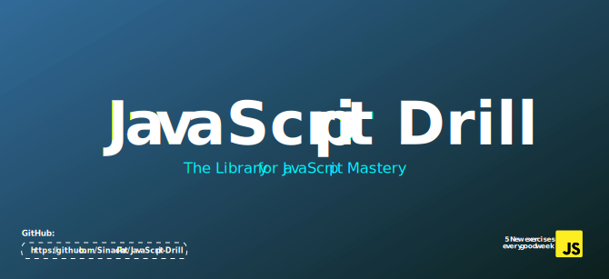

# JavaScript-Drill 

## Introduction
You may just be getting started with JavaScript or you've been learning for some time now, this playground is for you to build your muscles. 
If you read about a JavaScript concept but can't solve a problem with it you have not really learnt it.

Do you believe in "use it or lose it" ? Then, it's time to make use of what you know.

About the piece:
JsDrill is as the name implies a heads down kept in problem solving using JavaScript.
It spans from beginner concepts to more advanced use of JavaScript.

We'll also pay attention to data structures and algorithms and do well to mention in our explainer articles.

We'll make weekly updates of at least 5 exercises to the whole repository spread across the various concepts.
We'll keep updating each concept with their respective exercises as we go through various resources.

This is library for JavaScript Mastery

> If you are just starting out with JavaScript, this would be a very helpful resource: [Get Started with JavaScript](https://javascript.info/intro)

# What you'll find here:
* JavaScript exercises and solutions.
* Explainer articles
* References/Sources
* Books, Videos and other learning resources

> It'll be a library for JavaScript mastery from a mere resource to a community.
 
### Our community is COMING SOON

 ## Table of Contents:
 
  - [Community](#community)
  - [Essentials](#essentials)
  - [Articles](#articles)
  - [Cheatsheets](#cheatshets)
  - [Extensions](#extensions)
  - [Books](#books)
  - [Videos](#videos)
  - [Newsletters](#newsletters)
  - [Contributing](#contributing)
  - [License](#license)
  
  >This ReadME is still under development
  
## Contributing
Found an awesome package, article, blog, video etc.? Send me a pull request! Just follow the [guidelines](/CONTRIBUTING.md). Thank you!

## License
[Mit License](https://en.wikipedia.org/wiki/MIT_License)
